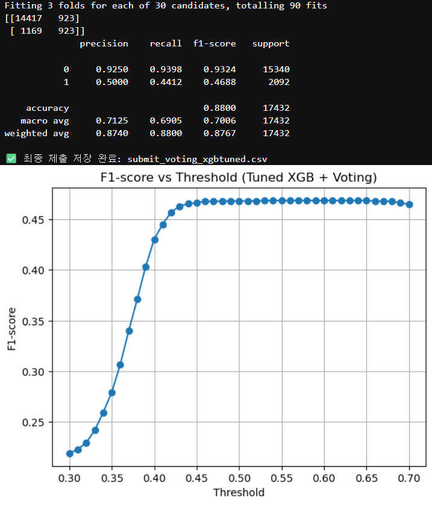

# 🧠 갑상선암 진단 분류 AI 프로젝트

> 의료 데이터를 기반으로 갑상선암 여부를 예측하는 머신러닝 프로젝트입니다.  
> 다양한 모델 학습과 하이퍼파라미터 튜닝, 앙상블을 통해 F1-score를 극대화하였습니다.

---

## 📌 프로젝트 개요

- **목표**: 환자의 다양한 의학적 지표(TSH, T3, T4 등)를 바탕으로 갑상선암 여부(`Cancer`)를 분류하는 모델 개발
- **접근 방법**: 데이터 전처리 → 모델별 튜닝 → 앙상블 → Threshold 조정 → 성능 시각화
- **사용 기술**: Python, Scikit-learn, XGBoost, CatBoost, LightGBM, Matplotlib

---

## 📊 모델 성능 결과 및 시각화

VotingClassifier 앙상블 모델의 최종 결과:

- **정확도 (Accuracy)**: 88.0%
- **클래스 1 (암) F1-score**: 0.4688
- 클래스 불균형 상황에서의 성능 평가



> ✅ 위 그래프는 다양한 threshold에 따른 F1-score 변화를 보여주며, 최적 threshold 선택의 근거가 됩니다.

---

## 💡 핵심 코드 스니펫

### Voting 앙상블 + Threshold 튜닝

```python
voting_model.fit(X_train, y_train)
y_val_prob = voting_model.predict_proba(X_val)[:, 1]

thresholds = np.arange(0.30, 0.71, 0.01)
f1_scores = [f1_score(y_val, y_val_prob > t) for t in thresholds]
best_thresh = thresholds[np.argmax(f1_scores)]
```

---

## 📎 참고 링크

- [XGBoost Documentation](https://xgboost.readthedocs.io/)
- [CatBoost Documentation](https://catboost.ai/)
- [LightGBM Documentation](https://lightgbm.readthedocs.io/)

